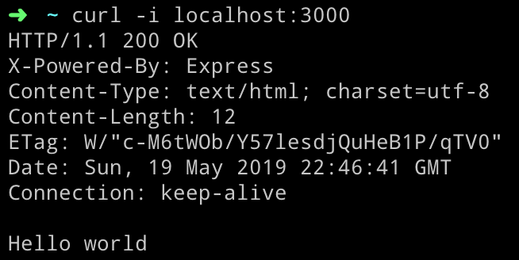
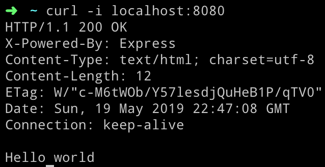
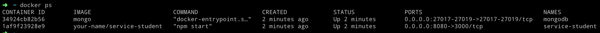

# Node.js Restful API

When this project is completed, it will be a complete Restful microservice that stores its data in the MongoDB. There will be Unit Tests, BDD tests and more.

## Prerequisites
Before that, you should have a running Docker Desktop in your pc.


# Let's Start

Firstly, clone the repository into your pc.

```
git clone https://github.com/aliatakan/service-student.git
```
Then, enter inside the project folder, give execute permission to `script.sh`

```
chmod 755 script.sh
```

Finally, execute it.

```
./script.sh
```

## This file will do the followings;
1. Installs packages and run the app (port: 3000)
2. Builds the Dockerfile and run the app as a container (port: 8080) 
2. Pulls MongoDB docker image, 
3. Runs MongoDB docker container,
4. Inserts some sample data into the MongoDB


## Now, you have 2 running service.
```
curl -i localhost:3000
```


```
curl -i localhost:3000
```


You have 2 running containers. `service-student` and `mongodb`


### GET http://localhost:3000/api/students/
Returns all the students
```json
{
"id": "5ce1dc83485dce9027c27ad5"
"name": "Tom"
"surname": "Wood"
},
{
"id": "5ce1dc83485dce9027c27ad6"
"name": "Lary"
"surname": "Thompson"
}, ....
```
